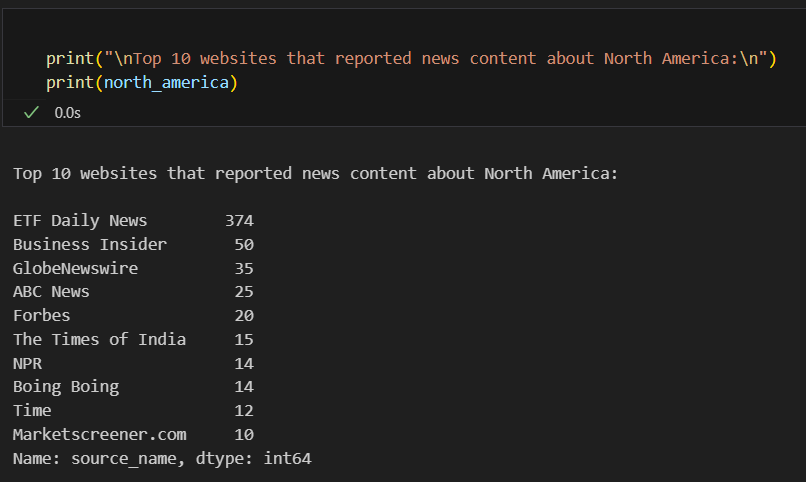

# Welcome to Week-0 Task-1 of 10 Academy's intensive training program!

## Overview

This project focuses on leveraging Git and GitHub for version control, setting up a Python environment, implementing continuous integration and continuous deployment (CI/CD), and employing key performance indicators (KPIs) related to development environment setup and relevant skills. The project also involves utilizing the CRISP-DM framework for project planning and conducting exploratory data analysis (EDA) and statistical thinking.

## Table of Contents

- [Project Title](#Welcome-to-Week-0-Task-1-of-10-Academy's-intensive-training-program!)
  - [Overview](#overview)
  - [Goals to Achieve](#goals-to-achieve)
  - [Installation](#installation)
  - [Usage](#usage)
    - [Branches](#branches)
    - [Commits](#commits)
    - [Code Organization](#code-organization)
    - [Notebooks](#notebooks)
  - [Contributing](#contributing)
  - [License](#license)

## Goals to Achieve

- **Dev Environment Setup:** Successfully set up the Python environment, Git version control, and CI/CD.
- **Relevant Skills Demonstration:** Showcase proficiency in the CRISP-DM framework, data understanding, EDA techniques, and statistical thinking.
- **Project Planning - EDA & Stats:** Effectively plan and execute the project using the CRISP-DM framework, perform EDA, and derive actionable insights from statistical analyses.
- **Topic Modeling** Model topics for categories and top words in those categories
- **Sentiment Analysis** Analyse sentiment and sentiment score on title and article
- **Correlation Analysis** Analyse correlation between each media outlets for similarity in content
- **Database Design and Configuration** Design a database using dbdiagram.io and configure postgresql
- **Frontend Development** Design and deploy frontend using React + Vue and Tailwind
- **Backend Development** Design and deploy backend using flask python framework

## Installation

To get started with the project, follow these installation steps:

1. **Python Environment:**
    ```bash
    python -m venv your_env_name
    ```

    Replace `your_env_name` with the desired name for your environment.
    
    **Activate the environment:**

    - On Windows:

    ```bash
    .\your_env_name\scripts\activate
    ```

    - On macOS/Linux:

    ```bash
    source your_env_name/bin/activate
    ```

2. **Clone this package**
    To install the `network_analysis` package, follow these steps:

    1. Clone the repository:
        ```bash
        git clone https://github.com/dev-abuke/News_Correlation_10_Academy_week0.git
        ```
    2. Navigate to the project directory:
        ```bash
        cd News_Correlation_10_Academy_week0
        ```
    
    3. Install the required dependencies:
        ```bash
        pip install -r requirements.txt
        ```


3. **Continuous Integration:**
    - CI/CD configurations are already set up. Refer to the CI/CD documentation for additional details.

## Usage

### Branches

In this repository, the branches are organized as follows:

- **main:** The main branch, initially forked from [https://github.com/10xac/week0_starter_network_analysis](https://github.com/10xac/week0_starter_network_analysis).

- **task-1:** The current branch for Day 1 analysis. 

  ```bash
  git checkout -b task-1
    ```


### Code Organization

Restructured the code by moving functions into `/src/loader.py` and `/src/utils.py`. In the analysis notebooks, used the `loader` from `/src/loader.py` and functions from `/src/utils.py` for data loading needs and helper functions.

## Notebooks
### Day 1 Analysis
`/notebooks/NewsEDA.ipynb`

## Analysis Results

### Top and Bottom Users

#### Article Count
- Websites that have the largest count of news articles.
***Top and Bottom 10 Websites - Article Count***
  
#### Global Rank
- Websites with the highest numbers of visitors traffic.
***Top and Bottom 10 Websites - Global Rank***
  
#### Media Count By Country
- Countries with the highest number of news media organisations.
***Top and Bottom 10 Websites - Media Count By Country***
  
#### Article By Country
- Countries that have many articles written about them.
***Top and Bottom 10 Websites - Article By Country***

    
#### Article By Continent
- Websites that reported (the news content) about Africa, US, China, EU, Russia, Ukraine, Middle East.
  - ***Top and Bottom 10 Websites - Africa***
  
  - ***Top and Bottom 10 Websites - Europe***
  
  - ***Top and Bottom 10 Websites - China***
  
  - ***Top and Bottom 10 Websites - Asia***
  
  - ***Top and Bottom 10 Websites - USA***
  

#### Sentiment Analysis
- Websites with the highest count of positive, neutral, and negative sentiment.
  ***Top and Bottom 10 Websites - Positive***
  - 
  ***Top and Bottom 10 Websites - Negative***
  -
  ***Top and Bottom 10 Websites - Neutral***
  -

### Topic Analysis

- How similar are the number of words in the title  across sites
  - ***Top 10 Websites (Source) - Title Length***
  *Title Length Distribution*
  

- The impact of frequent news reporting and sentiment to the website’s global ranking.
  - ***The impact of frequent news reporting***
    - *Scatter plot*
    

- Database schema design 
  - ***Design Db***
    

## Contributing
Contributions are welcome! Before contributing, please review our contribution guidelines.

##  License
This project is licensed under the MIT License.
